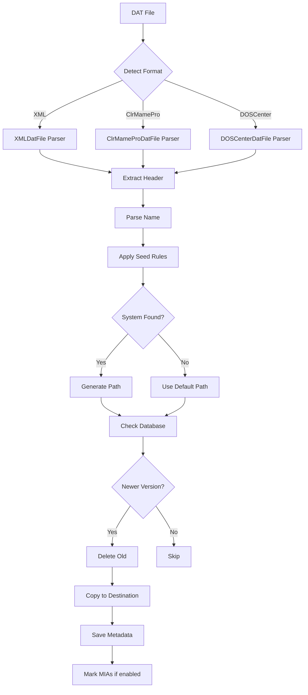

## What are DAT Files?

DAT files are XML or text-based databases that catalog ROM collections. They contain metadata about every ROM in a set, including:

- **Game names** and descriptions
- **File hashes** (CRC32, MD5, SHA-1) for verification
- **File sizes** to validate completeness
- **Region information** (USA, Europe, Japan, etc.)
- **Version details** and release dates
- **Relationships** between ROMs (clones, parents, BIOS files)

DAT files are maintained by preservation communities like Redump, No-Intro, and others to ensure ROM collections are complete, accurate, and verified.

## Why Use DAT Files?

<CardGroup cols={2}>
  <Card title="Verification" icon="shield-check">
    Verify your ROM dumps are accurate and complete by comparing hashes
  </Card>
  
  <Card title="Organization" icon="folder-tree">
    Automatically organize thousands of ROMs into a logical structure
  </Card>
  
  <Card title="Completeness" icon="list-check">
    Identify missing ROMs from your collection
  </Card>
  
  <Card title="Updates" icon="clock-rotate-left">
    Track new releases and updated versions of ROMs
  </Card>
</CardGroup>

## DAT File Formats

Datoso supports three main DAT file formats:

### XML Format

The most common format, used by Redump, No-Intro, and many others.

```xml
<?xml version="1.0"?>
<!DOCTYPE datafile PUBLIC "-//Logiqx//DTD ROM Management Datafile//EN" "http://www.logiqx.com/Dats/datafile.dtd">
<datafile>
    <header>
        <name>Sony - PlayStation 2</name>
        <description>Sony - PlayStation 2</description>
        <version>2024-03-01</version>
        <date>2024-03-01</date>
        <author>Redump</author>
    </header>
    <game name="Gran Turismo 4 (USA)">
        <description>Gran Turismo 4 (USA)</description>
        <rom name="Gran Turismo 4 (USA).iso" size="4699979776" crc="a4e8b3e2" md5="..." sha1="..."/>
    </game>
</datafile>
```

**Characteristics:**
- Human-readable XML structure
- Comprehensive metadata support
- Supports multiple ROMs per game
- Compatible with ROMVault, CLRMamePro

### ClrMamePro Format

Text-based format used by older tools and some arcade sets.

```
clrmamepro (
    name "FBNeo - Arcade Games"
    description "FBNeo - Arcade Games"
    version "1.0.0.13"
)

game (
    name "1941"
    description "1941: Counter Attack (World 900227)"
    rom ( name 41_09.12h size 32768 crc "3f8f774e" md5 "..." sha1 "..." )
    rom ( name 41_10.13h size 32768 crc "61bb769b" md5 "..." sha1 "..." )
)
```

**Characteristics:**
- Compact text format
- Key-value pairs in parentheses
- Multiple ROMs per game supported
- Used extensively in arcade preservation

### DOSCenter Format

A variant of ClrMamePro format used by Total DOS Collection.

```
DOSCenter (
    name: "Total DOS Collection"
    description: "DOS Games Collection"
    version: "2024-01"
)

game (
    name: "Prince of Persia (1990)"
    description: "Prince of Persia (1990)"
    rom ( name: "PRINCE.ZIP" size: 123456 crc: "abc123" )
)
```

**Characteristics:**
- Similar to ClrMamePro with colon separators
- Optimized for DOS software
- Single-file game entries common

## ROM Metadata Fields

Understanding the metadata in DAT files:

<AccordionGroup>
  <Accordion title="name" icon="tag">
    The unique identifier for the game or ROM file. Often includes region and version information.
    
    **Example**: `Gran Turismo 4 (USA)`
  </Accordion>

  <Accordion title="description" icon="text">
    Human-readable name of the game, may be more detailed than the name field.
    
    **Example**: `Gran Turismo 4 (USA) (NTSC)`
  </Accordion>

  <Accordion title="crc / crc32" icon="fingerprint">
    32-bit Cyclic Redundancy Check hash for quick verification.
    
    **Example**: `a4e8b3e2`
  </Accordion>

  <Accordion title="md5" icon="hashtag">
    128-bit MD5 hash for file verification.
    
    **Example**: `d41d8cd98f00b204e9800998ecf8427e`
  </Accordion>

  <Accordion title="sha1" icon="key">
    160-bit SHA-1 hash, the most secure verification method.
    
    **Example**: `da39a3ee5e6b4b0d3255bfef95601890afd80709`
  </Accordion>

  <Accordion title="size" icon="ruler">
    File size in bytes, used for quick validation before hashing.
    
    **Example**: `4699979776` (4.37 GB)
  </Accordion>

  <Accordion title="mia (optional)" icon="ghost">
    "Missing In Action" flag indicating the ROM is known but unavailable.
    
    **Example**: `mia="yes"`
  </Accordion>
</AccordionGroup>

## How Datoso Organizes ROMs

Datoso transforms flat DAT collections into a hierarchical folder structure optimized for emulators.

### Default Folder Structure

```
DatRoot/
├── Arcade/
│   ├── MAME/
│   │   └── MAME - Current.dat
│   └── FBNeo/
│       └── FBNeo - Arcade Games.dat
├── Nintendo/
│   ├── Nintendo - Game Boy/
│   │   └── Nintendo - Game Boy.dat
│   ├── Nintendo - Game Boy Advance/
│   │   └── Nintendo - Game Boy Advance.dat
│   ├── Nintendo - Nintendo 64/
│   │   └── Nintendo - Nintendo 64.dat
│   └── Nintendo - GameCube/
│       └── Nintendo - GameCube.dat
├── Sega/
│   ├── Sega - Mega Drive - Genesis/
│   │   ├── Sega - Mega Drive - Genesis.dat
│   │   └── Sega - Mega Drive - Genesis (Aftermarket - Unlicensed)/
│   │       └── Sega - Mega Drive - Genesis (Aftermarket - Unlicensed).dat
│   └── Sega - Dreamcast/
│       └── Sega - Dreamcast.dat
└── Sony/
    ├── Sony - PlayStation/
    │   └── Sony - PlayStation.dat
    ├── Sony - PlayStation 2/
    │   └── Sony - PlayStation 2.dat
    └── Sony - PlayStation Portable/
        └── Sony - PlayStation Portable.dat
```

### Organization Rules

DAT files are organized by:

1. **Company**: Manufacturer or platform owner (Nintendo, Sony, Sega, etc.)
2. **System**: Specific platform or console (PlayStation 2, Game Boy Advance, etc.)
3. **Modifier**: Additional categorization (Aftermarket, Translated, BIOS, etc.)

### Path Generation Logic

From `src/datoso/repositories/dat_file.py:104`:

```python
def get_path(self) -> str:
    """Get the path for the dat file."""
    suffixes = self.get_suffix()
    if not isinstance(suffixes, list):
        suffixes = [suffixes]
    self.path = os.path.join(*[x for x in [
        self.get_prefix(),    # Optional prefix
        self.get_company(),   # Nintendo, Sony, etc.
        self.get_system(),    # Game Boy, PlayStation 2
        *suffixes             # Modifiers
    ] if x])
    return self.path
```

## System Detection

Datoso uses seed-specific rules to automatically detect systems from DAT file names.

### Detection Process

1. **Parse DAT filename or header**: Extract name like "Sony - PlayStation 2"
2. **Apply regex patterns**: Match against known system patterns
3. **Lookup in systems.json**: Find system metadata and overrides
4. **Apply seed rules**: Use seed-specific detection logic
5. **Generate folder path**: Create organized directory structure

### System Types

Systems are classified by type in `src/datoso/systems.json`:

- **Console**: Home gaming consoles (PS2, Xbox, Switch)
- **Handheld**: Portable gaming devices (Game Boy, PSP, 3DS)
- **Computer**: Home computers (Commodore 64, Amiga, PC)
- **Arcade**: Arcade machines (MAME, FBNeo)
- **Other**: Miscellaneous systems (V.Tech, Pinball, etc.)

### System Overrides

The database supports overriding system properties:

```json
{
  "system": "PlayStation 2",
  "company": "Sony",
  "system_type": "Console",
  "override": {
    "system": "PS2"
  }
}
```

This allows customizing folder names without changing the DAT file itself.

## Modifiers and Suffixes

Modifiers categorize special ROM variants:

<Tabs>
  <Tab title="Common Modifiers">
    - **Aftermarket - Unlicensed**: Homebrew and unlicensed games
    - **Applications**: Non-game software
    - **Audio**: Soundtracks and audio CDs
    - **BIOS**: System BIOS files
    - **Bonus Discs**: Pack-in and promotional discs
    - **Coverdiscs**: Magazine coverdiscs
    - **Demos**: Demo and trial versions
    - **Educational**: Educational software
    - **Multimedia**: Multimedia applications
    - **Preproduction**: Beta and prototype versions
    - **Promotional**: Promotional releases
    - **Video**: Video content
  </Tab>
  
  <Tab title="Enhancement Modifiers">
    - **Enhanced Colors**: ROM hacks with improved graphics
    - **MSU-1**: SNES MSU-1 audio enhancement patches
    - **Speed Hacks**: Performance-improved versions
    - **Translations**: Fan-translated games
  </Tab>
  
  <Tab title="Source Types">
    - **Source Code**: Game source code releases
    - **Datasheets**: Hardware documentation
    - **Manuals**: Digital manuals
  </Tab>
</Tabs>

## DAT Processing Workflow

When Datoso processes a DAT file:



## Deduplication

Datoso can deduplicate ROMs between parent and child DATs to save space and reduce redundancy.

### Parent-Child Relationships

Define a parent DAT for deduplication:

```bash
datoso dat -d redump:"PlayStation 2 (Demos)" --set parent="redump:PlayStation 2"
```

During processing, ROMs in the child DAT that exist in the parent are removed.

### How It Works

From `src/datoso/repositories/dat_file.py:266`:

```python
def merge_with(self, parent: DatFile) -> None:
    """Merge the dat file with the parent."""
    parent.get_rom_shas()  # Build hash index
    new_games = []
    
    for game in self.data[self.main_key][self.game_key]:
        if 'rom' not in game:
            continue
        
        new_roms = []
        for rom in game['rom']:
            # Keep ROM only if not in parent
            if not parent.shas.has_rom(self.parse_rom(rom)):
                new_roms.append(rom)
            else:
                self.merged_roms.append(self.parse_rom(rom))
        
        game['rom'] = new_roms
        new_games.append(game)
```

### AutoMerge

AutoMerge automatically deduplicates within a single DAT:

```bash
datoso dat -d redump:"PlayStation 2" --set automerge=true
```

This removes duplicate ROM entries (same hash) within the DAT itself.

## MIA (Missing In Action) ROMs

Some ROMs are documented but unavailable for preservation. Datoso can mark these as MIA.

### Enabling MIA Processing

```ini
[PROCESS]
ProcessMissingInAction = true
MarkAllRomsInSet = false
```

### MIA Database

MIA records are stored in the database:

```json
{
  "system": "Sony - PlayStation 2",
  "game": "Gran Turismo 4 Prologue",
  "size": "1234567890",
  "crc32": "abc123",
  "sha1": "def456...",
  "md5": "789ghi..."
}
```

### How MIA Marking Works

From `src/datoso/repositories/dat_file.py:230`:

```python
def mark_mias(self, mias: dict) -> None:
    """Mark the mias in the dat file."""
    for game in self.data[self.main_key][self.game_key]:
        if 'rom' not in game:
            continue
        
        for rom in game['rom']:
            key = rom.get('@sha1') or rom.get('@md5') or rom.get('@crc32')
            if key in mias:
                rom['@mia'] = 'yes'
```

ROMs marked as MIA will have `mia="yes"` in the output DAT file.

## DAT File Metadata in Database

Every processed DAT is stored in TinyDB with metadata:

```json
{
  "_id": 42,
  "name": "Sony - PlayStation 2",
  "seed": "redump",
  "full_name": "Sony - PlayStation 2 (Redump)",
  "company": "Sony",
  "system": "PlayStation 2",
  "system_type": "Console",
  "modifier": null,
  "date": "2024-03-01",
  "version": "2024-03-01",
  "file": "/home/user/.datoso/tmp/redump/dats/Sony - PlayStation 2.dat",
  "new_file": "/home/user/roms/dats/Sony/PlayStation 2/Sony - PlayStation 2.dat",
  "path": "Sony/PlayStation 2",
  "static_path": null,
  "status": "enabled",
  "automerge": false,
  "parent": null
}
```

### Querying DAT Metadata

```bash
# Find all PlayStation DATs
datoso dat -d PlayStation

# Find specific DAT from specific seed
datoso dat -d redump:"PlayStation 2"

# Show only specific fields
datoso dat -d "PlayStation 2" --fields name date system path

# Get full name for setting properties
datoso dat -d redump:"PlayStation 2" -on
```

### Modifying DAT Properties

```bash
# Disable a DAT (won't be processed)
datoso dat -d redump:"PlayStation 2 (Demos)" --set status=disabled

# Set parent for deduplication
datoso dat -d redump:"PlayStation 2 (Demos)" --set parent="redump:PlayStation 2"

# Enable automerge
datoso dat -d redump:"PlayStation 2" --set automerge=true

# Set custom path
datoso dat -d redump:"PlayStation 2" --set static_path="/custom/path/PS2"

# Remove a property
datoso dat -d redump:"PlayStation 2" --unset parent
```

## Static Paths

Override automatic path generation with a static path:

```bash
datoso dat -d redump:"Sony - PlayStation 2" --set static_path="~/roms/Sony/PS2"
```

When a `static_path` is set, Datoso will use it instead of the generated path.

## Importing Existing DATs

Import DAT files you already have organized:

```bash
datoso import
```

The import process:

1. Scans `DatPath` for all `.dat` files recursively
2. Attempts to detect which seed each DAT belongs to
3. Parses each DAT file to extract metadata
4. Stores metadata in the database with current file path
5. Allows future updates without re-downloading

### Import Configuration

```ini
[IMPORT]
# Regex to ignore certain paths during import
IgnoreRegEx = .*/(backup|old|archive)/.*
```

## Working with ROM Collections

### Verification Workflow

1. **Download DATs**: Fetch latest DATs from sources
   ```bash
   datoso redump --fetch
   ```

2. **Process DATs**: Organize into folder structure
   ```bash
   datoso redump --process
   ```

3. **Use ROM Manager**: Import DATs into ROMVault or CLRMamePro

4. **Verify ROMs**: Use the ROM manager to check your collection against DATs

5. **Update**: Re-fetch and process periodically to get updates
   ```bash
   datoso redump --fetch --process
   ```

### Folder Organization Tips

<Tip>
Organize your ROM files to mirror the DAT folder structure:

```
roms/
├── dats/              # DAT files organized by Datoso
│   └── Sony/
│       └── PlayStation 2/
│           └── Sony - PlayStation 2.dat
└── files/             # ROM files matching the DAT structure
    └── Sony/
        └── PlayStation 2/
            ├── Gran Turismo 4 (USA).iso
            └── Final Fantasy X (USA).iso
```

This makes it easy to verify and organize your collection.
</Tip>

## Best Practices

<AccordionGroup>
  <Accordion title="Regular Updates" icon="calendar-check">
    Update DATs monthly or quarterly to stay current:
    
    ```bash
    # Update all seeds
    datoso all --fetch --process
    ```
  </Accordion>

  <Accordion title="Backup Before Processing" icon="floppy-disk">
    Keep backups of your organized DATs before processing updates:
    
    ```bash
    cp -r ~/roms/dats ~/roms/dats.backup
    datoso redump --process
    ```
  </Accordion>

  <Accordion title="Use Filters" icon="filter">
    Process only what you need to save time:
    
    ```bash
    datoso redump --process --filter "PlayStation 2"
    ```
  </Accordion>

  <Accordion title="Enable Deduplication" icon="copy">
    Save space by deduplicating demo and bonus disc DATs:
    
    ```bash
    datoso dat -d redump:"PlayStation 2 (Demos)" --set parent="redump:PlayStation 2"
    ```
  </Accordion>
</AccordionGroup>

## Next Steps

- [Configuration](/configuration/config-file) - Configure DAT paths and processing options
- [Commands Overview](/commands/overview) - Complete command-line reference
- [Understanding Datoso](/concepts/understanding-datoso) - Deep dive into architecture
