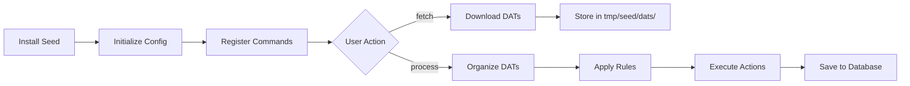

## What are Seeds?

Seeds are Datoso's plugin system that extends the core functionality to support different DAT file sources. Each seed implements the logic needed to:

- **Fetch**: Download DAT files from a specific source
- **Parse**: Understand source-specific naming and organization
- **Process**: Apply custom rules for organizing ROMs

Think of seeds as adapters that teach Datoso how to work with different ROM preservation communities and their DAT repositories.

## Architecture

Each seed is a standalone Python package that follows a standard structure:

```
datoso-seed-{name}/
├── __init__.py           # Metadata (__version__, __author__, __description__)
├── fetch.py              # Download logic
├── actions.py            # Processing pipeline definition
├── rules.py              # System detection and folder organization
└── args.py (optional)    # Additional CLI arguments
```

### Seed Lifecycle



## Available Official Seeds

Datoso supports multiple ROM preservation communities through official seeds:

### Active Seeds

<CardGroup cols={2}>
  <Card title="FBNeo" icon="gamepad">
    Final Burn Neo arcade emulator DATs
  </Card>
  
  <Card title="No-Intro" icon="folder">
    No-Intro Datomatic - Cartridge-based systems
  </Card>
  
  <Card title="Redump" icon="compact-disc">
    Redump - Disc-based systems
  </Card>
  
  <Card title="Pleasuredome" icon="star">
    Pleasuredome MAME sets
  </Card>

  <Card title="TDC" icon="computer">
    Total DOS Collection
  </Card>
  
  <Card title="VPinMAME" icon="bowling-ball">
    Visual Pinball ROM sets
  </Card>
  
  <Card title="WHDLoad" icon="floppy-disk">
    Amiga WHDLoad packages
  </Card>
  
  <Card title="Eggman" icon="egg">
    Teknoparrot and ALL.Net arcade ROMs
  </Card>
</CardGroup>

### Deprecated Seeds

<Warning>
The following seeds are deprecated and included for backwards compatibility:
- **md_enhanced**: Mega Drive Enhanced (use enhanced seed)
- **sfc_enhancedcolors**: Super Famicom Enhanced Colors (use enhanced seed)
- **sfc_msu1**: Super Famicom MSU1 (use enhanced seed)
- **sfc_speedhacks**: Super Famicom Speed Hacks (use enhanced seed)
- **translatedenglish**: Translated English ROMs (superseded by newer organization)
</Warning>

## Seed Details

### FBNeo

**Package**: `datoso-seed-fbneo`

Final Burn Neo is a multi-system arcade emulator. This seed manages DAT files for arcade ROM sets.

<Tabs>
  <Tab title="Installation">
    ```bash
    pip install datoso[fbneo]
    # or
    pip install datoso-seed-fbneo
    ```
  </Tab>
  
  <Tab title="Usage">
    ```bash
    # Fetch arcade DATs
    datoso fbneo --fetch
    
    # Process and organize
    datoso fbneo --process
    ```
  </Tab>
  
  <Tab title="Features">
    - Arcade system detection
    - Board/hardware classification
    - BIOS file handling
    - Clone relationship management
  </Tab>
</Tabs>

### No-Intro

**Package**: `datoso-seed-nointro`

No-Intro maintains preservation sets for cartridge-based systems through Datomatic.

<Tabs>
  <Tab title="Installation">
    ```bash
    pip install datoso[nointro]
    # or
    pip install datoso-seed-nointro
    ```
  </Tab>
  
  <Tab title="Usage">
    ```bash
    # Fetch all No-Intro DATs
    datoso nointro --fetch
    
    # Process only Nintendo systems
    datoso nointro --process --filter Nintendo
    ```
  </Tab>
  
  <Tab title="Systems Covered">
    - Nintendo (NES, SNES, N64, GameCube, Wii, etc.)
    - Sega (Genesis, Master System, Game Gear, etc.)
    - Sony handhelds (PSP, PS Vita)
    - Handheld systems (Game Boy, DS, 3DS, etc.)
    - Many other cartridge-based platforms
  </Tab>
</Tabs>

<Note>
No-Intro DATs may require solving CAPTCHAs during fetch. Datoso will pause and prompt you if needed.
</Note>

### Redump

**Package**: `datoso-seed-redump`

Redump preserves disc-based systems with verified dumps including hashes for all tracks.

<Tabs>
  <Tab title="Installation">
    ```bash
    pip install datoso[redump]
    # or
    pip install datoso-seed-redump
    ```
  </Tab>
  
  <Tab title="Usage">
    ```bash
    # Fetch Redump DATs
    datoso redump --fetch
    
    # Process PlayStation systems only
    datoso redump --process --filter PlayStation
    ```
  </Tab>
  
  <Tab title="Systems Covered">
    - Sony (PlayStation, PS2, PS3, PSP)
    - Microsoft (Xbox, Xbox 360)
    - Nintendo (GameCube, Wii, Wii U)
    - Sega (Dreamcast, Saturn, CD, etc.)
    - PC and CD-ROM based systems
  </Tab>
</Tabs>

### Pleasuredome

**Package**: `datoso-seed-pleasuredome`

Pleasuredome provides MAME ROM sets and related arcade preservation.

<Tabs>
  <Tab title="Installation">
    ```bash
    pip install datoso[pleasuredome]
    # or
    pip install datoso-seed-pleasuredome
    ```
  </Tab>
  
  <Tab title="Usage">
    ```bash
    datoso pleasuredome --fetch
    datoso pleasuredome --process
    ```
  </Tab>
  
  <Tab title="Features">
    - MAME full ROM sets
    - CHD (Compressed Hunks of Data) support
    - Software lists
    - BIOS collections
  </Tab>
</Tabs>

### TDC (Total DOS Collection)

**Package**: `datoso-seed-tdc`

Total DOS Collection preserves DOS games and software.

<Tabs>
  <Tab title="Installation">
    ```bash
    pip install datoso[tdc]
    # or
    pip install datoso-seed-tdc
    ```
  </Tab>
  
  <Tab title="Usage">
    ```bash
    datoso tdc --fetch
    datoso tdc --process
    ```
  </Tab>
</Tabs>

### VPinMAME

**Package**: `datoso-seed-vpinmame`

Visual Pinball ROM sets for pinball machine emulation.

<Tabs>
  <Tab title="Installation">
    ```bash
    pip install datoso[vpinmame]
    # or
    pip install datoso-seed-vpinmame
    ```
  </Tab>
  
  <Tab title="Usage">
    ```bash
    datoso vpinmame --fetch
    datoso vpinmame --process
    ```
  </Tab>
</Tabs>

### WHDLoad

**Package**: `datoso-seed-whdload`

WHDLoad packages for Amiga games installed to hard disk.

<Tabs>
  <Tab title="Installation">
    ```bash
    pip install datoso[whdload]
    # or
    pip install datoso-seed-whdload
    ```
  </Tab>
  
  <Tab title="Usage">
    ```bash
    datoso whdload --fetch
    datoso whdload --process
    ```
  </Tab>
</Tabs>

### Eggman

**Package**: `datoso-seed-eggman`

Teknoparrot and ALL.Net arcade system ROMs.

<Tabs>
  <Tab title="Installation">
    ```bash
    pip install datoso[eggman]
    # or
    pip install datoso-seed-eggman
    ```
  </Tab>
  
  <Tab title="Usage">
    ```bash
    datoso eggman --fetch
    datoso eggman --process
    ```
  </Tab>
</Tabs>

## Installing Multiple Seeds

Install all official seeds at once:

```bash
pip install datoso[all]
```

Or select specific seeds:

```bash
pip install datoso[redump,nointro,fbneo]
```

## Managing Seeds

### List Installed Seeds

```bash
datoso seed list
```

Output example:
```
Installed seeds:
* fbneo - Final Burn Neo arcade emulator DATs
* nointro - No-Intro Datomatic cartridge-based systems
* redump - Redump disc-based systems preservation
```

### View Seed Details

```bash
datoso seed details redump
```

Output:
```
Seed redump details:
  * Name: datoso_seed_redump
  * Version: 1.0.1
  * Author: Lacides Miranda
  * Description: Redump disc-based systems preservation
```

### Check Seed Health

```bash
# Check all seeds
datoso doctor

# Check specific seed
datoso doctor redump
```

The doctor command validates:
- Python dependencies are installed
- Module can be imported correctly
- Required configuration exists
- Network connectivity (for fetch operations)

## Processing All Seeds

Process DATs from all installed seeds at once:

```bash
# Fetch from all seeds
datoso all --fetch

# Process all seeds
datoso all --process

# Combined operation
datoso all --fetch --process
```

## How Seeds Work

### Fetch Module

Each seed's `fetch.py` implements the download logic:

```python
def fetch():
    """Download DAT files from source."""
    # 1. Connect to source (HTTP, FTP, API, etc.)
    # 2. Authenticate if needed
    # 3. List available DATs
    # 4. Download to tmp/{seed}/dats/
    # 5. Handle errors and retries
```

Common fetch patterns:
- **HTTP scraping**: Parse HTML to find download links
- **API calls**: Use REST APIs where available
- **Direct downloads**: Simple file downloads from known URLs
- **FTP**: Connect to FTP servers for file retrieval

### Rules Module

The `rules.py` module defines how to detect systems and organize folders:

```python
from datoso.seeds.rules import Rules

class SeedRules(Rules):
    def get_company(self, name):
        """Extract company from DAT name."""
        if "Sony" in name:
            return "Sony"
        if "Nintendo" in name:
            return "Nintendo"
        return None
    
    def get_system(self, name):
        """Extract system/platform."""
        if "PlayStation 2" in name:
            return "PlayStation 2"
        return None
```

### Actions Module

The `actions.py` module defines the processing pipeline:

```python
def get_actions():
    """Return action pipeline for processing."""
    return {
        '{dat_origin}': [
            {'action': 'LoadDatFile', '_class': DatFile},
            {'action': 'DeleteOld', 'folder': '{dat_destination}'},
            {'action': 'Copy', 'folder': '{dat_destination}'},
            {'action': 'Deduplicate'},
            {'action': 'SaveToDatabase'},
            {'action': 'MarkMias'},
        ]
    }
```

Available actions:
- **LoadDatFile**: Parse DAT file
- **DeleteOld**: Remove outdated versions
- **Copy**: Copy to organized location
- **Deduplicate**: Remove duplicate ROMs
- **AutoMerge**: Merge related DATs
- **SaveToDatabase**: Persist metadata
- **MarkMias**: Flag missing ROMs

## Seed Configuration

Seeds can have their own configuration sections in `datoso.config`:

```ini
[REDUMP]
# Seed-specific settings
Username = your_username
Password = your_password

[NOINTRO]
# Override default actions
OverrideActions = LoadDatFile,Copy,SaveToDatabase
```

## Creating Custom Seeds

While this documentation covers official seeds, you can create your own:

<Steps>
  <Step title="Clone the base seed template">
    ```bash
    git clone https://github.com/laromicas/datoso_seed_base
    ```
  </Step>
  
  <Step title="Implement required modules">
    - `__init__.py`: Metadata
    - `fetch.py`: Download logic
    - `actions.py`: Processing pipeline
    - `rules.py`: System detection
  </Step>
  
  <Step title="Install and test">
    ```bash
    pip install -e .
    datoso doctor your_seed
    ```
  </Step>
</Steps>

<Info>
For detailed instructions on developing custom seeds, see the [datoso_seed_base](https://github.com/laromicas/datoso_seed_base) repository.
</Info>

## Seed Best Practices

<AccordionGroup>
  <Accordion title="Rate Limiting" icon="gauge">
    Implement respectful rate limiting in fetch modules to avoid overwhelming source servers:
    
    ```python
    import time
    
    def fetch():
        for dat in dats:
            download(dat)
            time.sleep(1)  # Wait 1 second between downloads
    ```
  </Accordion>

  <Accordion title="Error Handling" icon="triangle-exclamation">
    Handle network errors gracefully and provide useful error messages:
    
    ```python
    try:
        response = requests.get(url, timeout=30)
        response.raise_for_status()
    except requests.RequestException as e:
        logger.error(f"Failed to download {url}: {e}")
        return False
    ```
  </Accordion>

  <Accordion title="Incremental Updates" icon="arrows-rotate">
    Only download changed DATs by checking dates or ETags:
    
    ```python
    if remote_date > local_date:
        download(dat)
    else:
        logger.info(f"Skipping {dat}, already up to date")
    ```
  </Accordion>

  <Accordion title="Authentication" icon="key">
    Store credentials securely in configuration, never in code:
    
    ```python
    from datoso.configuration import config
    
    username = config.get('SEEDNAME', 'Username')
    password = config.get('SEEDNAME', 'Password')
    ```
  </Accordion>
</AccordionGroup>

## Troubleshooting Seeds

### Seed Not Found

```
Module datoso_seed_redump not found
```

**Solution**: Install the seed package
```bash
pip install datoso-seed-redump
```

### Import Errors

```
Error: cannot import name 'fetch' from 'datoso_seed_redump'
```

**Solution**: Update the seed to the latest version
```bash
pip install --upgrade datoso-seed-redump
```

### Fetch Failures

```
Errors fetching redump
```

**Solution**: Run doctor to diagnose
```bash
datoso doctor redump --verbose
```

Common causes:
- Network connectivity issues
- Source website changes
- Authentication problems
- Rate limiting or IP blocks

## Next Steps

- [DATs and ROMs](/concepts/dats-and-roms) - Understanding DAT file formats and ROM organization
- [Configuration](/configuration/config-file) - Configure seed-specific settings
- [Plugin Development](/advanced/plugin-development) - Create your own custom seed
