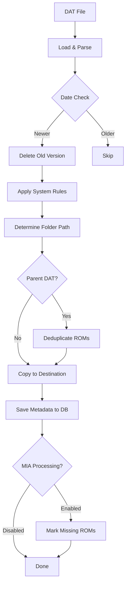

## What is Datoso?

Datoso (DAT Organizer and SOrter) is a Python command-line tool designed to download, organize, and manage ROM DAT files from various sources. It transforms the way you organize your ROM collections by merging DAT files from different sources into a unified folder structure optimized for emulators rather than traditional DAT organization.

## Core Architecture

Datoso follows a modular architecture with clear separation of concerns:

### Component Overview

```
┌─────────────────────────────────────────────────────────┐
│                    Datoso Core                          │
├─────────────────────────────────────────────────────────┤
│  Commands Layer                                         │
│  ├── fetch  (Download DAT files)                        │
│  ├── process (Organize & deduplicate)                   │
│  ├── dat    (Manage DAT metadata)                       │
│  └── import (Import existing DATs)                      │
├─────────────────────────────────────────────────────────┤
│  Seeds (Plugin System)                                  │
│  ├── Fetch Logic                                        │
│  ├── DAT Rules                                          │
│  └── Action Definitions                                 │
├─────────────────────────────────────────────────────────┤
│  Processing Engine                                      │
│  ├── LoadDatFile                                        │
│  ├── DeleteOld                                          │
│  ├── Copy                                               │
│  ├── Deduplicate                                        │
│  ├── AutoMerge                                          │
│  └── MarkMias                                           │
├─────────────────────────────────────────────────────────┤
│  Database Layer (TinyDB)                                │
│  ├── DAT Metadata                                       │
│  ├── System Definitions                                 │
│  └── MIA (Missing In Action) Records                    │
└─────────────────────────────────────────────────────────┘
```

### Key Components

<AccordionGroup>
  <Accordion title="Commands Layer" icon="terminal">
    The commands layer provides the user-facing CLI interface:
    
    - **config**: Manage configuration settings
    - **doctor**: Validate seed installations and requirements
    - **dat**: Query and modify DAT file properties in the database
    - **seed**: Execute seed-specific operations (fetch, process)
    - **import**: Import existing DAT files from RomVault or other sources
    - **deduper**: Remove duplicate ROMs between parent and child DATs
    
    Located in: `src/datoso/commands/`
  </Accordion>

  <Accordion title="Seeds (Plugins)" icon="puzzle-piece">
    Seeds are the plugin system that defines how to fetch and process DATs from different sources. Each seed implements:
    
    - **Fetch Module**: Logic to download DATs from the source
    - **Rules**: System detection and folder organization rules
    - **Actions**: Processing pipeline configuration
    
    Seeds are installed separately as packages like `datoso-seed-redump`.
    
    Located in: Core at `src/datoso/seeds/`, individual seeds as separate packages
  </Accordion>

  <Accordion title="Processing Engine" icon="gears">
    The processor executes a pipeline of actions on each DAT file:
    
    1. **LoadDatFile**: Parse DAT file (XML, ClrMamePro, or DOSCenter format)
    2. **DeleteOld**: Remove outdated versions based on date comparison
    3. **Copy**: Copy DAT to the organized folder structure
    4. **Deduplicate**: Remove ROMs that exist in parent DATs
    5. **AutoMerge**: Merge DATs that share the same target
    6. **SaveToDatabase**: Persist metadata to the database
    7. **MarkMias**: Flag Missing In Action ROMs
    
    Located in: `src/datoso/actions/processor.py`
  </Accordion>

  <Accordion title="Database Layer" icon="database">
    Uses TinyDB (JSON-based) to store:
    
    - **DAT Metadata**: Name, seed, version, date, system, file paths
    - **System Definitions**: Platform mappings, company names, folder rules
    - **MIA Records**: Known missing or unavailable ROMs
    - **Seed Configuration**: Per-seed settings and overrides
    
    Located in: `src/datoso/database/`
  </Accordion>

  <Accordion title="DAT File Parsers" icon="file-code">
    Datoso supports multiple DAT file formats:
    
    - **XMLDatFile**: Standard XML format (most common)
    - **ClrMameProDatFile**: ClrMamePro text format
    - **DOSCenterDatFile**: DOS Center variant format
    
    All formats are normalized to a common internal structure for processing.
    
    Located in: `src/datoso/repositories/dat_file.py`
  </Accordion>
</AccordionGroup>

## The Fetch → Process Workflow

Datoso operates in two distinct phases that work together to organize your ROM collection.

### Phase 1: Fetch

The fetch phase downloads DAT files from their source repositories:

```bash
datoso redump --fetch
```

**What happens during fetch:**

1. Seed's fetch module connects to the source (e.g., Redump website)
2. Downloads available DAT files to a temporary directory
3. Organizes downloads by seed name: `~/.datoso/tmp/{seed}/dats/`
4. Handles authentication, rate limiting, and download management
5. No processing or organization occurs yet

<Info>
The fetch phase is completely isolated from processing. You can fetch from multiple seeds before processing any of them.
</Info>

### Phase 2: Process

The process phase organizes, deduplicates, and structures your DAT files:

```bash
datoso redump --process
```

**What happens during process:**



**Step-by-step breakdown:**

1. **LoadDatFile**: Parse the DAT file format and extract metadata
   - Detects format (XML, ClrMamePro, etc.)
   - Extracts name, description, date, version
   - Reads game and ROM entries

2. **DeleteOld**: Check database for existing versions
   - Compares dates to determine if newer
   - Removes old physical files if updating
   - Skips if existing version is newer

3. **System Detection & Path Generation**:
   - Uses seed rules to identify system/platform
   - Determines company (Nintendo, Sony, etc.)
   - Applies modifiers (e.g., "Source Code", "Translated")
   - Generates folder path: `{Company}/{System}/{Modifier}/`

4. **Copy**: Move DAT to organized structure
   - Creates destination folders as needed
   - Preserves DAT file format and name
   - Updates file path in database

5. **Deduplicate** (if parent DAT defined):
   - Compares ROM hashes against parent DAT
   - Removes duplicate ROMs already in parent
   - Keeps unique ROMs in child DAT

6. **SaveToDatabase**: Persist all metadata
   - Stores DAT properties in TinyDB
   - Enables querying and management via CLI
   - Tracks version history

7. **MarkMias** (optional):
   - Flags ROMs known to be unavailable
   - Uses community-maintained MIA lists
   - Adds `mia="yes"` attribute to ROM entries

## Configuration System

Datoso uses INI-style configuration with multiple layers:

### Configuration Hierarchy

1. **Default Config**: Built into Datoso (`src/datoso/datoso.ini`)
2. **Global Config**: `~/.config/datoso/datoso.config`
3. **Local Config**: `.datosorc` in current directory
4. **Command-line Flags**: Override all other settings

### Key Configuration Sections

<CodeGroup>

```ini PATHS
[PATHS]
DatosoPath = ~/.datoso
DownloadPath = ~/.datoso/tmp
DatPath = ~/roms/dats
DatabaseFile = datoso.db
```

```ini PROCESS
[PROCESS]
Overwrite = false
ProcessMissingInAction = false
AutoMergeEnabled = false
ParentMergeEnabled = false
MarkAllRomsInSet = false
```

```ini IMPORT
[IMPORT]
# Regex to ignore certain DATs during import
IgnoreRegEx = 
```

</CodeGroup>

<Tip>
Use `datoso config` to view your current configuration, and `datoso config --set SECTION.Option value` to modify settings.
</Tip>

## Database Schema

The TinyDB database stores four main types of records:

### DAT Records

```json
{
  "name": "Sony - PlayStation 2",
  "seed": "redump",
  "full_name": "Sony - PlayStation 2",
  "system": "PlayStation 2",
  "company": "Sony",
  "system_type": "Console",
  "date": "2024-03-01",
  "version": "2024-03-01",
  "file": "/path/to/original.dat",
  "new_file": "/path/to/organized.dat",
  "path": "Sony/PlayStation 2/",
  "status": "enabled",
  "automerge": false,
  "parent": null
}
```

### System Records

Define how systems are organized and named:

```json
{
  "system": "PlayStation 2",
  "company": "Sony",
  "system_type": "Console",
  "override": {
    "system": "PS2"
  }
}
```

## Action Pipeline Customization

Seeds define their processing pipeline through action configurations. Here's an example from `src/datoso/seeds/`:

```python
def get_actions():
    return {
        '{dat_origin}': [
            {
                'action': 'LoadDatFile',
                '_class': DatFile,
            },
            {
                'action': 'DeleteOld',
                'folder': '{dat_destination}',
            },
            {
                'action': 'Copy',
                'folder': '{dat_destination}',
            },
            {
                'action': 'Deduplicate',
            },
            {
                'action': 'SaveToDatabase',
            },
            {
                'action': 'MarkMias',
            },
        ]
    }
```

<Note>
Actions can be customized per seed or even per system using configuration overrides.
</Note>

## Error Handling & Recovery

Datoso includes several mechanisms for handling errors:

### Doctor Command

```bash
datoso doctor [seed]
```

Validates:
- Required Python packages are installed
- Seed modules can be loaded
- Configuration is valid
- Database is accessible
- Network connectivity for fetches

### Logging

Enable detailed logging for troubleshooting:

```bash
datoso --verbose redump --process
```

Logs are written to `~/.datoso/datoso.log` when logging is enabled via config.

## Performance Considerations

<CardGroup cols={2}>
  <Card title="Parallel Fetching" icon="download">
    Fetch multiple seeds simultaneously by running separate commands in parallel
  </Card>
  
  <Card title="Filter Processing" icon="filter">
    Use `--filter` to process only specific DATs matching a pattern
  </Card>
  
  <Card title="Incremental Updates" icon="clock">
    Only downloads and processes changed DATs based on date comparison
  </Card>
  
  <Card title="Database Flushing" icon="database">
    Explicit flush operations ensure data consistency without performance overhead
  </Card>
</CardGroup>

## Next Steps

Now that you understand how Datoso works, explore:

- [Seeds](/concepts/seeds) - Deep dive into the plugin system
- [DATs and ROMs](/concepts/dats-and-roms) - Understanding DAT file formats and organization
- [Configuration Reference](/configuration/config-file) - Full configuration options
